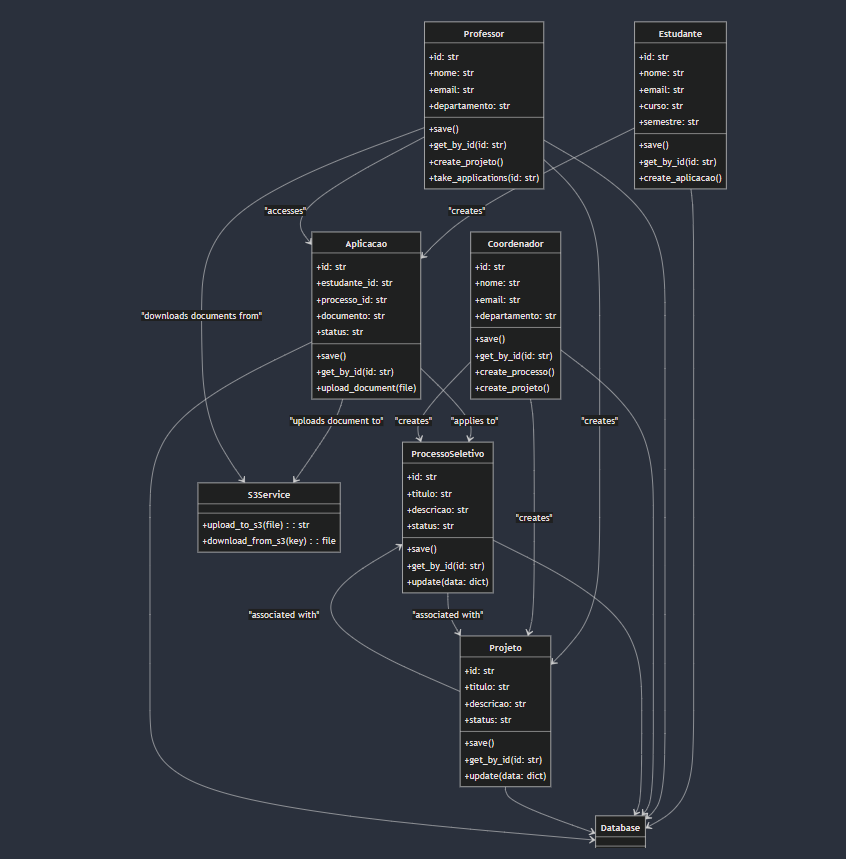

<!--
This README file is part of the Projeto-agil-insper-backend repository.
It serves as the main documentation for the project, providing an overview,
setup instructions, usage guidelines, and other relevant information.
-->
  
# Projeto-agil-insper-backend

## Application Architecture

Our Flask application uses the MVC pattern:

- **Models**: Define data models and interact with the database.
- **Controllers**: Contain the business logic and handle requests.
- **Routes**: Define API endpoints and route requests to controllers.

## Class Diagram 



### Project Structure

````
├── controllers/
│   ├── [aplicacao_controller.py](controllers/aplicacao_controller.py)
│   ├── [processo_controller.py](controllers/processo_controller.py)
│   ├── [professor_controller.py](controllers/professor_controller.py)
│   └── ... other controllers
├── models/
│   ├── [aplicacao.py](models/aplicacao.py)
│   ├── [processo_seletivo.py](models/processo_seletivo.py)
│   ├── [professor.py](models/professor.py)
│   └── ... other models
├── routes/
│   └── ... route definitions
├── [run.py](run.py)
└── ... other files and directories
````

### Models

- **ProcessoSeletivo**: Located in [`models/processo_seletivo.py`](models/processo_seletivo.py), this model handles database interactions related to selection processes.
- **Professor**: Located in [`models/professor.py`](models/professor.py), this model handles database interactions related to the professor object handling.
- **Projeto**: Located in [`models/projeto.py`](models/projeto.py), this model handles dabatase interactions with projeto objects.
- **Aplicacao**: Located in [`models/aplicacao.py`](models/aplicacao.py), this model handles dababase interactions with aplicacao objects.
- **Estudante**: Located in [`models/estudante.py`](models/estudante.py), this model handles database interactions related to the student (estudante) entity.
- **Coordenador**: Located in [`models/coordenador.py](models/coordenador.py), this model handles database interactions related to the coordinator (coordenador) entity.
- **User**: Located in [`models/user.py](models/user.py), this model handles database interactions related to the coordinator (user) entity.

### Disclaimer on User Database Structure

Our application’s database architecture includes a **global `User` database** and additional, role-specific databases (`Estudante`, `Professor`, `Coordenador`). This design decision is intentional and based on the need to manage both shared and role-specific information in a streamlined and modular way.

#### Design Rationale

- **Global User Representation**: The `User` database holds general information common to all users, regardless of role. This allows us to manage all users as a single entity for authentication, identification, and shared attributes like `email`, which serves as a unique identifier.
  
- **Role-Specific Information**: Each user role (e.g., `Estudante`, `Professor`, `Coordenador`) has unique data requirements and operations. Role-specific databases (`Estudante`, `Professor`, `Coordenador`) store this additional information separately, which keeps each user type’s data cleanly organized and minimizes complexity when adding role-specific fields.

- **Data Fetching Logic**: For general user interactions (e.g., login, account settings), our application queries the global `User` database. When role-specific information is required, such as student records or professor-specific details, the application uses the email identifier to query the respective role-specific database (e.g., `Estudante`).

> **Note**: This setup requires additional caution, as any delete or update operation on one database must be reflected in the others. Failure to synchronize operations between these databases introduces serious risks to the system’s data integrity.


### Controllers

# Controller Documentation

This documentation provides an overview of the controllers in your project. Each controller handles the business logic for specific components of the application, interacting with models to perform data operations and processing input from routes.

- [Aplicação Controller](#aplicação-controller)
- [Auth Controller](#auth-controller)
- [Coordenador Controller](#coordenador-controller)
- [Estudante Controller](#estudante-controller)
- [Processo Controller](#processo-controller)
- [Professor Controller](#professor-controller)
- [Projeto Controller](#projeto-controller)
- [How Controllers Interact with Other Components](#how-controllers-interact-with-other-components)
- [Notes on Data Integrity](#notes-on-data-integrity)

## Aplicação Controller
**File:** `controllers/aplicacao_controller.py`

### Overview
The Aplicação Controller handles the business logic related to applications (Aplicacao) submitted by students for projects. It manages the creation, updating, and retrieval of application data, interacting with the Aplicacao model and other related models such as Projeto, ProcessoSeletivo, and Estudante.

### Functions
- **create_aplicacao(data: dict)**  
  - **Description:** Creates a new application for a project, handling file uploads, validating related entities, and saving application data.
  - **Parameters:**  
    - `data`: A dictionary containing the application data.
  - **Returns:** Success or failure message with HTTP status code.

- **update_aplicacao(data: dict)**  
  - **Description:** Updates an existing application.
  - **Parameters:**  
    - `data`: A dictionary with updated application data.
  - **Returns:** Success or failure message with HTTP status code.

## Auth Controller
**File:** `controllers/auth_controller.py`

### Overview
The Auth Controller manages authentication-related logic, including user registration and login, interacting with the User model and using JWT tokens for authentication sessions.

### Functions
- **User Registration**  
  - Handles creation of new user accounts with data validation and uniqueness checks.
- **User Login**  
  - Validates user credentials and issues JWT tokens.

## Coordenador Controller
**File:** `controllers/coordenador_controller.py`

### Overview
The Coordenador Controller handles coordinator-specific logic, such as managing selection processes and overseeing projects.

### Functions
- **Create Selection Process**  
  - Creates new selection processes, ensuring data validity.
- **Manage Projects**  
  - Allows viewing and managing projects associated with selection processes.

## Estudante Controller
**File:** `controllers/estudante_controller.py`

### Overview
The Estudante Controller manages student-specific logic, such as retrieving student information and managing profiles.

### Functions
- **Get Student Information**  
  - Retrieves detailed information about a student.
- **Update Student Profile**  
  - Allows students to update profile information.

## Processo Controller
**File:** `controllers/processo_controller.py`

### Overview
The Processo Controller is responsible for the business logic related to selection processes (ProcessoSeletivo). It supports creating, updating, retrieving, and deleting processes.

### Functions
- **create_processo(data: dict)**  
  - **Description:** Creates a new selection process.
  - **Parameters:**  
    - `data`: A dictionary with selection process details.
  - **Returns:** Success message and ID with status code 201.

- **update_processo_by_id(data: dict, id: str)**  
  - **Description:** Updates a selection process by ID.
  - **Parameters:**  
    - `data`: Updated selection process data.
    - `id`: ID of the process to update.
  - **Returns:** Success or failure message with status code.

- **get_all_processos()**  
  - **Description:** Retrieves all selection processes.
  - **Returns:** List of selection processes or error message.

- **get_processo_by_id(id: str)**  
  - **Description:** Retrieves a selection process by ID.
  - **Parameters:**  
    - `id`: ID of the selection process.
  - **Returns:** Selection process data or error message.

- **delete_processo(id: str)**  
  - **Description:** Deletes a selection process by ID.
  - **Parameters:**  
    - `id`: ID of the selection process to delete.
  - **Returns:** Success or failure message.

## Professor Controller
**File:** `controllers/professor_controller.py`

### Overview
The Professor Controller manages logic related to professors, including project creation and managing professor data.

### Functions
- **get_all()**  
  - **Description:** Retrieves all professors.
  - **Returns:** List of professors or error message.

- **Create Project**  
  - Allows professors to create new projects with proper data validation.

## Projeto Controller
**File:** `controllers/projeto_controller.py`

### Overview
The Projeto Controller handles project (Projeto) logic, managing creation, updating, retrieval, and deletion of projects, interacting with the Projeto model and related entities like ProcessoSeletivo and Professor.

### Functions
- **create_projeto(data: dict)**  
  - **Description:** Creates a new project within a selection process.
  - **Parameters:**  
    - `data`: Project details, including selection process ID.
  - **Returns:** Success message, ID, and HTTP status code 201.

- **update_projeto(data: dict, id: str)**  
  - **Description:** Updates an existing project by ID.
  - **Parameters:**  
    - `data`: Updated project data.
    - `id`: Project ID.
  - **Returns:** Success or failure message.

- **get_projeto(id: str)**  
  - **Description:** Retrieves a project by ID.
  - **Parameters:**  
    - `id`: Project ID.
  - **Returns:** Project data or error message.

- **get_projetos_by_processo(id: str)**  
  - **Description:** Retrieves projects associated with a selection process.
  - **Parameters:**  
    - `id`: Selection process ID.
  - **Returns:** List of projects or error message.

- **get_all_projetos()**  
  - **Description:** Retrieves all projects.
  - **Returns:** List of projects or error message.

- **delete_projeto(data: dict)**  
  - **Description:** Deletes a project.
  - **Parameters:**  
    - `data`: Project data, including project ID.
  - **Returns:** Success or failure message.

## How Controllers Interact with Other Components
Controllers act as intermediaries between routes and models. Routes call controller functions, which process data, interact with models, and return responses to routes to send to clients.

### Example: Creating a Selection Process
1. **Route Handling**  
   - Client request hits a route defined in `processo_routes.py`.
2. **Controller Logic**  
   - Route calls `create_processo` in `processo_controller.py`.
3. **Model Interaction**  
   - Uses `ProcessoSeletivo` model to create a new instance.
4. **Response**  
   - Client receives confirmation, new process ID, and success status.

## Notes on Data Integrity
- **Consistency in Database Operations**  
  - Controllers ensure changes reflect across related models. For example, `create_projeto` updates the associated selection process with the new project's ID.

- **Validation and Error Handling**  
  - Controllers validate input data and handle exceptions, returning error messages with HTTP status codes (e.g., 400 Bad Request, 404 Not Found).

# API Documentation

This documentation provides an overview of key API endpoints for creating and updating various resources within the application, including selection processes, projects, and applications.

---

### 1. Create Processo Seletivo
- **Endpoint:** `/selection_process`
- **Method:** `POST`
- **Controller Function:** `coordination.create_selection_process`
- **Permitioning**: `Coordenador`

**Request Structure:**

```json
{
  "titulo": "Título do Processo Seletivo",
  "data_encerramento": "YYYY-MM-DD"
}
```

**Example Request:**

```json

  [
    {
        "message": "Processo created successfully with id 67242dddaf0c60d16f9a32c0"
    },
    201
]

```

---

### 2. Update Processo Seletivo
- **Endpoint:** `/selection_process/<id>`
- **Method:** `PUT`
- **Controller Function:** `processo_controller.update_processo_by_id`
- **Permitioning**: `Coordenador`

**Request Structure:**

```json
{
  "titulo": "Novo Título do Processo Seletivo",
  "data_encerramento": "new ending date of the proccess in YYYY-MM-DD"
}
```

**Example Request:**

```json
 {
    "message": "Processo Seletivo updated successfully with id 671f811a2e33a765fc56eb7a"
}
```

---

### 3. Create Projeto
- **Endpoint:** `/projects`
- **Method:** `POST`
- **Controller Function:** `professor.create_project`
- **Permitioning**: `Professor`, `Coordenador`

**Request Structure:**

```json
{
  "titulo": "Título do Projeto",
  "descricao": "Descrição detalhada do projeto",
  "processo_seletivo": "string",  // ID do processo seletivo
  "temas": ["string"], // Lista de temas 
  "professor": "string" // ID do professor
}
```

**Example Request:**

```json
{
    "processo_seletivo":"671f811a2e33a765fc56eb7a",
    "professor": "671f7d61241759e9bc1869e7",
    "temas": ["engenharia"],
    "descricao": "projeto de engenharia",
    "titulo": "teste titulo 2"
}
```

---

### 4. Update Projeto
- **Endpoint:** `/projects/<id>`
- **Method:** `PUT`
- **Controller Function:** `projeto_controller.update_projeto`
-  **Permitioning**: `Coordenador`, `Professor` [has to be the one that created the Projeto]


**Request Structure:**

```json
{
  "titulo": "Novo Título do Projeto",
  "descricao": "Atualização da descrição do projeto."
}
```

**Example Request:**

```json
{
  "titulo": "Análise de Dados com Python",
  "descricao": "Projeto atualizado para análise de dados com ferramentas Python."
}
```

---

### 5. Create Aplicação
- **Endpoint:** `/aplicacoes`
- **Method:** `POST`
- **Controller Function:** `aplicacao_controller.create_aplicacao`

**Request Structure:**  
Content-Type: `multipart/form-data`

**Form Data Fields:**
- `aplicacao_pdf`: File (PDF document)
- `projeto`: `"string"` (ID do projeto)
- `estudante`: `"string"` (ID do estudante)
- `processo_seletivo`: `"string"` (ID do processo seletivo)
- `estudante_lattes`: `"string"` (URL do currículo Lattes do estudante)

**Example Request Using curl:**

```bash
curl -X POST http://api.example.com/aplicacoes \
-F "aplicacao_pdf=@/path/to/file.pdf" \
-F "projeto=projeto123" \
-F "estudante=estudante456" \
-F "processo_seletivo=processo_seletivo789" \
-F "estudante_lattes=http://lattes.cnpq.br/0987654321"
```

---

### 6. Update Aplicação (TO DO)
- **Endpoint:** `/aplicacoes/<id>`
- **Method:** `PUT`
- **Controller Function:** `aplicacao_controller.update_aplicacao`

**Request Structure:**

```json
{
  "id": "aplicacao123",
  "estudante_lattes": "http://lattes.cnpq.br/0987654321"
}
```

**Example Request:**

```json
{
  "id": "aplicacao123",
  "estudante_lattes": "http://lattes.cnpq.br/0987654321"
}
```


### TO DO -> Get aplicações de um determinado professor -> dado um professor, pega os projetos dele e as aplicações relacionadas 

### TO DO -> Delete nos usuarios, garantir q qnd apage um user global apague o respectivo nos dbs especiifcos 

### TO DO -> PUT nas aplicacoes, so o aluno q criou pode editar 

### TO DO (low priority for now) -> Com o professor vendo as aplicações, poder escolher uma que vai passar e qnd fizer isso disparar o email pro aluno daquela aplicação avisando

---